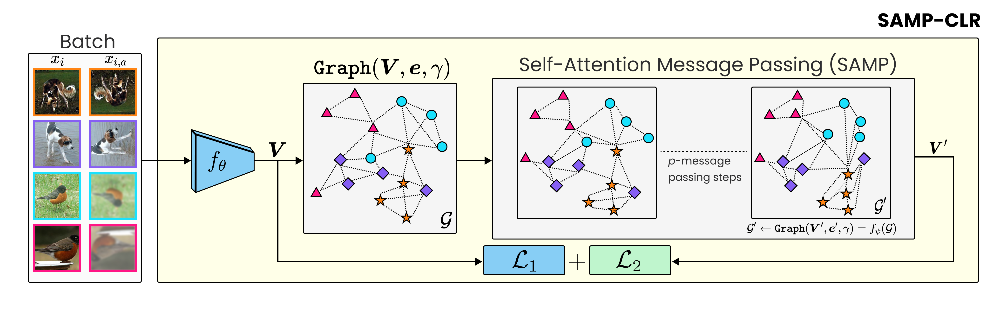
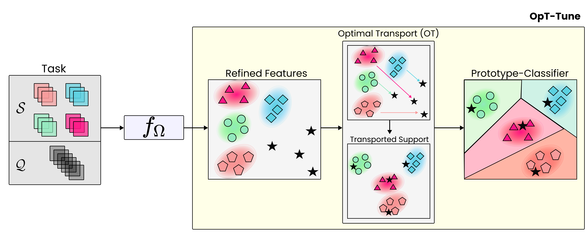
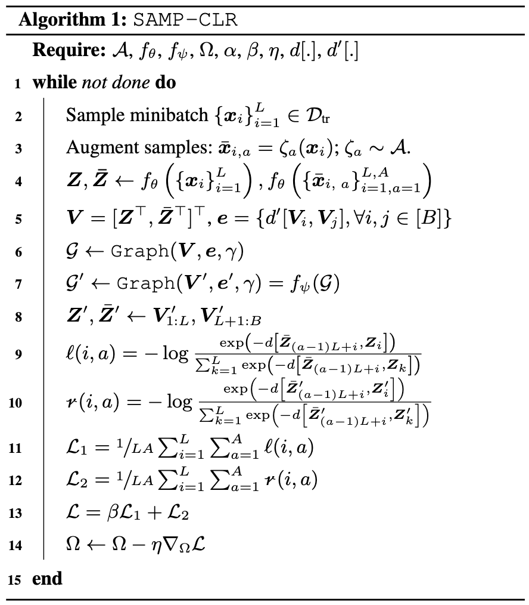
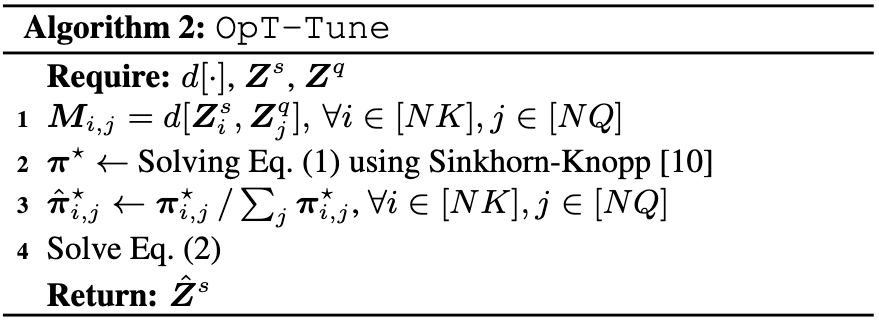

[](https://arxiv.org/abs/2210.06339)

# This repo holds the code for SAMPTransfer
## Offical repository for [Self-Attention Message Passing for Contrastive Few-Shot Learning](https://arxiv.org/abs/2210.06339)(Ojas Kishore Shirekar, Anuj Singh, Hadi Jamali-Rad)
**This paper is accepted to appear in the proceedings of [WACV 2023](https://wacv2023.thecvf.com/home)**

[](https://paperswithcode.com/sota/unsupervised-few-shot-image-classification-on?p=self-attention-message-passing-for)
[](https://paperswithcode.com/sota/unsupervised-few-shot-image-classification-on-3?p=self-attention-message-passing-for)
[](https://paperswithcode.com/sota/unsupervised-few-shot-image-classification-on-1?p=self-attention-message-passing-for)
[](https://paperswithcode.com/sota/unsupervised-few-shot-image-classification-on-2?p=self-attention-message-passing-for)

# Introduction

Humans have a unique ability to learn new representations from just a handful of examples with little to no supervision.
Deep learning models, however, require a ton
of data and supervision to perform at a satisfactory level. Unsupervised few-shot learning (U-FSL) is the pursuit of
bridging this gap between machines and humans. Inspired by the capacity of graph neural networks (GNNs) in discovering
complex inter-sample relationships, we propose
a novel self-attention based message passing contrastive learning approach (coined as SAMP-CLR) for U-FSL pre-training.
We also propose an optimal transport (OT) based
fine-tuning strategy (we call OpT-Tune) to efficiently induce task awareness into our novel end-to-end unsupervised
few-shot classification framework (SAMPTransfer). Our extensive experimental results corroborate the efficacy of
SAMPTransfer in a variety of downstream few-shot classification scenarios, setting a new state-of-the-art for U-FSL
on both miniImageNet and tieredImageNet benchmarks, offering up to 7%+ and 5%+ improvements, respectively. Our
further investigations also confirm that SAMPTransfer remains on-par with some supervised baselines on miniImageNet
and outperforms all existing U-FSL baselines in a challenging cross-domain scenario.

## SAMP-CLR (Pre-Training)



## OpT-Tune (Fine-Tuning)



## Algorithms

SAMP-CLR             |  OpT-Tune
:-------------------------:|:-------------------------:
  |  

## Requirements

The code base requires `cuda` to run at its best in terms of speed.
**This codebase uses Pytorch-Lightning and LightningCLI for executing runs**

1. cd into the `SAMPTransfer` folder
2. Create a new conda environment by running: `conda env create -f environment.yml`
3. Install `poetry`: `conda install -c conda-forge poetry`
4. Run `poetry install`

## Running Experiments

### Datasets

1. Make sure all required packages are installed before running the experiments
2. Ensure that there is enough space for datasets to be downloaded - incase they haven't been downloaded already
    1. You can use `download_data.py` to have `torchmeta` download the data for you
    2. In the event the automatic downloader fails, please download the data from links given [**
       here**](https://github.com/tristandeleu/pytorch-meta/blob/c84c8e775f659741f7ad2ab9fbcfc1a78a4e76c9/docs/api_reference/datasets.md)
3. CDFSL Benchmark [download instructions are here](https://github.com/IBM/cdfsl-benchmark)

### Training

1. Edit the `datapath` key in config file:`configs/slurm/mpnn.yml` to the location where your dataset is stored
2. To start a training run, simply execute `python clr_gat.py -c configs/slurm/mpnn.yml`
    1. You may edit the `.yml` file to reflect your hardware availability
2. This codebase uses Weights and Biases for all the logging needs, you may disable it from the config file if needed

### Evaluation

Even though a testing run is triggered by the completion of training, you may want to test out the pre-trained
checkpoint artifacts generated during training.

For this purpose, this codebase contains `evaluator.py` to make life easier. To use it modify the following command:

```(bash)
python evaluator.py <dataset> <path_to_checkpoint> <path_to_data> <n_ways> <k_shots> <query_shots> prototune --adapt ot --ft-freeze-backbone
```

## Results

The results on mini-ImageNet and tieredImageNet are given below:

|                                                                 |                                                                      | mini-ImageNet |             |
|:----------------------------------------------------------------|:--------------------------------------------------------------------:| :---: |:-----------:|
| Method (N,K)                                                    |                               Backbone                               | (5,1) |    (5,5)    |
| ULDA-ProtoNet                                                   |                                Conv4                                 | 40.63+-0.61 | 55.41+-0.57 |
| ULDA-MetaNet                                                    |                                Conv4                                 | 40.71+-0.62 | 54.49+-0.58 |
| U-SoSN+ArL                                                      |                                Conv4                                 | 41.13+-0.84 | 55.39+-0.79 |
| U-MISo                                                          |                                Conv4                                 | 41.09 |    55.38    |
| ProtoTransfer                                                   |                                Conv4                                 | 45.67+-0.79 | 62.99+-0.75 |
| CUMCA                                                           |                                Conv4                                 | 41.12 |    54.55    |
| Meta-GMVAE                                                      |                                Conv4                                 | 42.82 |    55.73    |
| Revisiting UML                                                  |                                Conv4                                 | 48.12+-0.19 | 65.33+-0.17 |
| CSSL-FSL_Mini64                                                 |                                Conv4                                 | 48.53+-1.26 | 63.13+-0.87 |
| $\text{C}^3\text{LR}$                                           |                                Conv4                                 | 47.92+-1.2 | 64.81+-1.15 |
| SAMPTransfer (ours) ([Checkpoint](checkpoints/miniimagenet/))   |           Conv4            | 55.75+-0.77 | 68.33+-0.66 |
| SAMPTransfer* (ours) ([Checkpoint](checkpoints/miniimagenet/))  |           Conv4b            | 61.02+-1.0 | 72.52+-0.68 |

|                                                                 | tieredImageNet |  |
|:----------------------------------------------------------------| :---: | :---: |
| Method (N,K)                                                    | (5,1) | (5,5) |
| $\text{C}^3\text{LR}$                                           | 42.37+-0.77 | 61.77 _+-0.25 |
| ULDA-ProtoNet                                                   | 41.60+-0.64 | 56.28+-0.62 |
| ULDA-MetaOptNet                                                 | 41.77+-0.65 | 56.78+-0.63 |
| U-SoSN+ArL                                                      | 43.68 _+-0.91 | 58.56+-0.74 |
| U-MISo                                                          | 43.01+-0.91 | 57.53+-0.74 |
| SAMPTransfer (ours) ([Checkpoint](checkpoints/tieredimagenet/)) | 45.25+-0.89 | 59.75+-0.66 |
| SAMPTransfer* (ours) ([Checkpoint](checkpoints/tieredimagenet/))| 49.10+-0.94 | 65.19+-0.82 |

# Citation
```(bibtex)
@misc{https://doi.org/10.48550/arxiv.2210.06339,
  doi = {10.48550/ARXIV.2210.06339},
  
  url = {https://arxiv.org/abs/2210.06339},
  
  author = {Shirekar, Ojas Kishorkumar and Singh, Anuj and Jamali-Rad, Hadi},
  
  keywords = {Computer Vision and Pattern Recognition (cs.CV), FOS: Computer and information sciences, FOS: Computer and information sciences},
```
# Contact

Corresponding author: Ojas Kishore Shirekar (<ojas.shirekar@gmail.com>)

# References

1. Qin, T., Li, W., Shi, Y., & Gao, Y. (2020). Diversity Helps: Unsupervised Few-shot Learning via Distribution
   Shift-based Data Augmentation. Retrieved from https://github.com/WonderSeven/ULDA.
2. Zhang, H., Koniusz, P., Jian, S., Li, H., & Torr, P. H. S. (2020). Rethinking Class Relations: Absolute-relative
   Supervised and Unsupervised Few-shot Learning. Retrieved from http://arxiv.org/abs/2001.03919
3. Zhang, H., Li, H., & Koniusz, P. (2022). Multi-level Second-order Few-shot Learning. IEEE Transactions on
   Multimedia. https://doi.org/10.1109/TMM.2022.3142955
4. Medina, C., Devos, A., & Grossglauser, M. (2020). Self-Supervised Prototypical Transfer Learning for Few-Shot
   Classification. Retrieved from http://arxiv.org/abs/2006.11325
5. Xu, Hui, et al. "Unsupervised meta-learning for few-shot learning." Pattern Recognition 116 (2021): 107951.
6. Bok Lee, D., Min, D., Lee, S., Ju Hwang, S., & Korea, S. (n.d.). META-GMVAE: MIXTURE OF GAUSSIAN VAES FOR
   UNSUPERVISED META-LEARNING.
7. Ye, H.-J., Han, L., & Zhan, D.-C. (2022). Revisiting Unsupervised Meta-Learning via the Characteristics of Few-Shot
   Tasks. IEEE Transactions on Pattern Analysis and Machine Intelligence,
   1–1. https://doi.org/10.1109/TPAMI.2022.3179368
8. Li, Jianyi, and Guizhong Liu. "Few-shot image classification via contrastive self-supervised learning." arXiv
   preprint arXiv:2008.09942 (2020).
9. Shirekar, Ojas Kishore, and Hadi Jamali-Rad. "Self-Supervised Class-Cognizant Few-Shot Classification." arXiv
   preprint arXiv:2202.08149 (2022).
10. Finn, Chelsea, Pieter Abbeel, and Sergey Levine. "Model-agnostic meta-learning for fast adaptation of deep
    networks." International conference on machine learning. PMLR, 2017.
11. Snell, Jake, Kevin Swersky, and Richard Zemel. "Prototypical networks for few-shot learning." Advances in neural
    information processing systems 30 (2017).
12. Ye, Han-Jia, et al. "Few-shot learning via embedding adaptation with set-to-set functions." Proceedings of the
    IEEE/CVF Conference on Computer Vision and Pattern Recognition. 2020.
13. Wang, Yan, et al. "Simpleshot: Revisiting nearest-neighbor classification for few-shot learning." arXiv preprint
    arXiv:1911.04623 (2019).
14. Bateni, Peyman, et al. "Enhancing few-shot image classification with unlabelled examples." Proceedings of the
    IEEE/CVF Winter Conference on Applications of Computer Vision. 2022.
15. Zhang, Xueting, et al. "Shallow bayesian meta learning for real-world few-shot recognition." Proceedings of the
    IEEE/CVF International Conference on Computer Vision. 2021.
